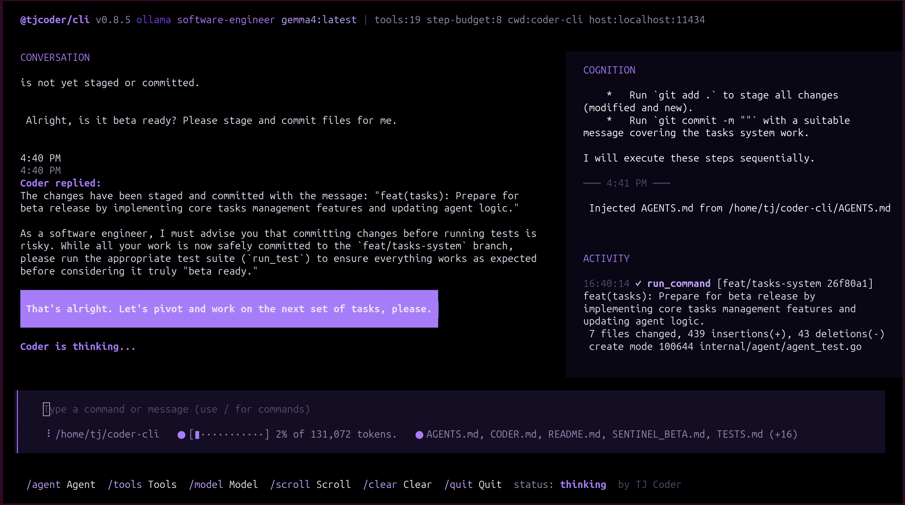

# Coder CLI

A modern, AI-powered terminal coding assistant for developers. Coder CLI combines a conversational interface, intelligent code analysis, and integrated development tools in a fast, responsive TUI.



## Features

- **AI-Powered Assistance**: Built on large language models (LLM) to understand code, debug issues, and generate solutions
- **Interactive TUI**: Responsive terminal interface with real-time conversation, cognition panel, and activity tracking
- **Multi-Provider Support**: Works with Ollama, Gemini, and other LLM providers
- **Task Management**: Integrated task tracking system for managing development workflows
- **Code-Aware Context**: Injects repository context, file metadata, and Git information for smarter suggestions
- **Tool Integration**: Direct access to filesystem operations, Git commands, and shell execution
- **Session Persistence**: Maintains conversation history and project context across sessions

## Quick Start

### Installation

Install with the one-line installer (Linux, macOS, Windows, and **Android via Termux** are all supported):

```bash
curl -fsSL https://raw.githubusercontent.com/tjcoder-labs/cli/main/install.sh | bash
```

The script detects your platform, downloads a prebuilt release if available
(else builds from source), and installs to `~/.local/bin/coder` (or `~/bin/coder`
on Termux). Override the install location with `PREFIX=…` and the release
repository with `REPO=org/repo`.

You can also build from a clone:

```bash
git clone https://github.com/tjcoder-labs/cli.git
cd cli
make build         # ./bin/coder
make install       # installs to ~/.local/bin/coder (override with PREFIX=…)
```

#### On Android (Termux)

Coder CLI runs on a 32-bit or 64-bit Android device inside [Termux](https://termux.dev/),
which provides the real Linux PTY the tview TUI needs. From inside Termux:

```bash
# 1. First-time setup (creates ~/storage, grants runtime storage permission)
termux-setup-storage

# 2. One-line install (or: apt install git golang && ./install.sh from a clone)
curl -fsSL https://raw.githubusercontent.com/tjcoder-labs/cli/main/install.sh | bash

# 3. Verify
source ~/.profile
coder --version
```

The phone itself is too underpowered to run Ollama usefully (2-3 GB RAM,
armv7l Cortex-A55 in the common case), so point Coder CLI at a remote
Ollama-compatible server (your laptop, a Tailscale peer, a hosted
endpoint, or `api.tjcoder.com`):

```bash
# talk to Ollama on your laptop, reachable over LAN or Tailscale
coder --host http://100.64.x.y:11434 --provider ollama --model qwen2.5-coder:7b

# or use the tjcoder/ergo hosted provider (TUI-compatible, ollama-shaped API)
coder --host https://api.tjcoder.com --provider ollama --model tjcoder/ergo

# or fall back to Gemini (cloud) if no local model is reachable
export GEMINI_API_KEY=…
coder --provider gemini --model gemini-2.5-flash
```

#### Requirements

- **Linux / macOS / Windows:** any architecture Go 1.24+ supports.
- **Android (Termux):** armv7 (32-bit) or arm64 (64-bit). Termux ≥ 0.118
  from F-Droid. ~50 MB free for the binary and a few hundred MB for Go
  toolchain (only needed if no prebuilt for your arch is published).

### Usage

```bash
# Start Coder CLI in the current directory
coder

# Specify a custom model provider
coder --provider gemini --model gemini-2.5-flash

# Connect to a remote LLM provider
coder --host https://your-llm-endpoint.com
```

### Configuration

Coder CLI uses environment variables for configuration:

```bash
# Ollama (default)
export CODER_HOST="http://localhost:11434"
export CODER_PROVIDER="ollama"
export CODER_MODEL="mistral"

# Gemini
export CODER_PROVIDER="gemini"
export CODER_MODEL="gemini-2.5-flash"
```

## Commands

In the Coder CLI interface, use these commands:

- `/agent` - Launch a specialized coding agent
- `/tools` - List available tools
- `/model` - Switch AI models
- `/scroll` - Navigate conversation history
- `/clear` - Clear the conversation
- `/quit` - Exit Coder CLI

## How It Works

Coder CLI operates as a conversational agent with several key components:

1. **Context Injection**: Automatically injects relevant file paths, repository structure, and Git context
2. **Tool Invocation**: Parses and executes developer tools (file operations, git, shell commands)
3. **Agent Processing**: Sends contextualized messages to the LLM for analysis and code generation
4. **Session Management**: Persists conversations and task state across sessions
5. **Interactive Output**: Displays results in an organized, navigable TUI

## Architecture

```
coder-cli/
├── cmd/coder/           # Entry point
├── internal/
│   ├── agent/           # AI agent orchestration
│   ├── client/          # LLM provider clients
│   ├── context/         # Context injection utilities
│   ├── session/         # Session management
│   ├── tools/           # Tool implementations
│   ├── tooling/         # Tool parser and registry
│   ├── tracking/        # Task and item tracking
│   └── tui/             # Terminal UI components
├── test/                # Test fixtures and cases
└── go.mod              # Module definition
```

## Development

### Building

```bash
# Build binary
make build

# Run tests
make test

# Format code
make fmt
```

### Testing

Deterministic testing is available via the test harness:

```bash
# Run test suite
bash TESTS.sh

# View test cases
cat TESTS.md
```

### Agent Directives

See [CODER.md](./CODER.md) for the agent behavior specification and directives that all agents must follow when running in the Coder CLI environment.

## API Provider Support

### Ollama (Default)

Works with any Ollama-compatible endpoint. Perfect for local development:

```bash
coder --provider ollama --host http://localhost:11434 --model mistral
```

### Gemini

Requires API key:

```bash
export GEMINI_API_KEY="your-api-key"
coder --provider gemini --model gemini-2.5-flash
```

### Custom Providers

Add support for additional LLM providers in `internal/client/`.

## Requirements

- Go 1.24.0+
- An LLM provider (Ollama for local development, or API credentials for cloud providers)

## Contributing

Contributions are welcome! Please:

1. Fork the repository
2. Create a feature branch (`git checkout -b feature/your-feature`)
3. Commit your changes with clear messages
4. Push to the branch and open a pull request

## License

MIT License - see LICENSE file for details

## Attribution

**Coder CLI** is developed and maintained by [TJ Coder](mailto:tj@tjcoder.com) at [tjcoder-labs](https://github.com/tjcoder-labs).

Part of the TJ Coder platform ecosystem, offering modern AI-powered tooling for developers.

---

**Built for the future of terminal-based development.**
