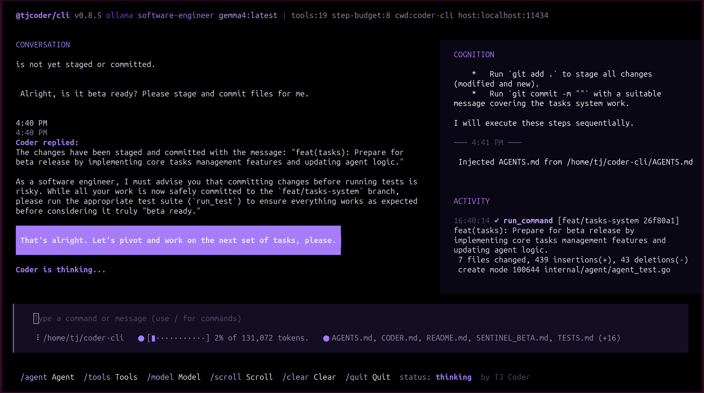

<div align="center">

# Coder CLI

**An AI-powered terminal coding assistant — designed and built for the future, from the command line.**

A fast, keyboard-driven TUI that pairs a conversational agent with real developer tools: filesystem operations, shell execution, Git, task tracking, and a live "cognition" view of the model's reasoning. Runs against local Ollama models or cloud providers.

[](./LICENSE)
[](https://go.dev)
[](https://www.npmjs.com/package/@tjcoder/cli)
[](https://github.com/tjcoder-labs)



</div>

---

## Highlights

- **Conversational coding agent** — understands your repo, edits files, runs commands, and iterates toward a working solution.
- **Adaptive TUI** — Conversation, Cognition (live reasoning), and Activity panes, with in-pane editors and a fullscreen mode for the transcript.
- **Interactive *and* headless** — drive it as a full TUI, or script it non-interactively with `coder -p "…"` (great for pipelines and CI).
- **Specialized agents** — swap between purpose-built agents (software engineer, terminal specialist, code reviewer, Android assistant, cloud expert, social researcher, storyteller).
- **Browser bridge** — drive real Chrome over CDP: navigate, click, type, screenshot, manage cookies and tabs across multiple isolated profiles. Lifecycle tools (`start_chrome` / `stop_chrome` / `chrome_status`) let agents spin up and clean up per-port browser sessions.
- **Social research mode** — the `social-researcher` agent combines `browser_bridge` with a persistent interaction ledger and scoped note store to research Reddit/LinkedIn/Gemini without ever repeating an upvote, like, comment, or DM.
- **Multi-line paste** — paste entire code blocks or documents into the input field; they're kept as one message, not split at each newline.
- **Markdown table rendering** — GFM pipe tables in model output are rendered as box-drawn tables in the transcript, cognition, and recap panes.
- **Editable context injection** — a `{{token}}` environment template lets you control exactly what runtime context the model sees.
- **Robust tool invocation** — native tool-calls plus a fenced-JSON fallback parser, so even smaller local models can use tools reliably.
- **Session persistence** — conversation history, tasks, and project context survive across runs, per workspace.
- **Multi-provider** — Ollama (default, local or cloud) and Google Gemini out of the box.

## Installation

### npm (recommended for Node users)

```bash
npm install -g @tjcoder/cli
```

The `postinstall` hook downloads the right prebuilt binary for your platform — no Go toolchain required. After install, `coder` is on your `PATH`.

### One-line install (recommended for everyone else)

```bash
curl -fsSL https://raw.githubusercontent.com/tjcoder-labs/cli/main/install.sh | bash
```

The installer detects your OS/arch, downloads a prebuilt binary when available (falling back to a source build if `go` is present), and installs `coder` to `~/.local/bin`. It also checks for Ollama and offers to install it with a default model. Override with `INSTALL_DIR=/usr/local`, pin a release with `VERSION=…`, or auto-install Ollama with `INSTALL_OLLAMA=1`.

### Install with Ollama

```bash
# Install Coder CLI + Ollama + pull a default model in one go
INSTALL_OLLAMA=1 curl -fsSL https://raw.githubusercontent.com/tjcoder-labs/cli/main/install.sh | bash

# Specify a different model
OLLAMA_MODEL=minimax-m3:cloud INSTALL_OLLAMA=1 curl -fsSL https://raw.githubusercontent.com/tjcoder-labs/cli/main/install.sh | bash
```

### From source

```bash
git clone https://github.com/tjcoder-labs/cli.git
cd cli
make build          # produces ./bin/coder
make install        # installs `coder` onto your PATH
```

### Requirements

- **An LLM provider** — a local or cloud [Ollama](https://ollama.com) endpoint, or a Google Gemini API key
- **Go 1.25+** (only for building from source)

## Quick Start

```bash
# Launch the interactive TUI in the current directory
coder

# Use a specific model
coder --model gemma4:cloud

# Point at a remote Ollama-compatible endpoint
coder --host https://your-ollama-endpoint.com

# Use Google Gemini
export GEMINI_API_KEY="your-api-key"
coder --provider gemini --model gemini-2.5-flash
```

If you're running Ollama locally, pull a coding-capable model first:

```bash
ollama pull gemma4:cloud        # default for the software-engineer agent
ollama pull minimax-m3:cloud    # strong tool-use alternative
```

## Interactive Mode

Type a message to chat, or use slash commands. Start typing `/` to see inline suggestions. Paste multi-line blocks directly — they're kept as a single message and submitted with Enter.

| Command | Description |
| --- | --- |
| `/agent` | Choose a specialized agent |
| `/agentinfo` | View the active agent's prompt and tools |
| `/model` | Switch the active model |
| `/tools` | Toggle which tools are enabled |
| `/environment` | Edit the injected context template (`{{token}}` interpolation) |
| `/config` | Edit user config (e.g. `toolMax`, bubble width) |
| `/task` · `/tasks` | Create a task · open the interactive task pane |
| `/memory` | Manage persistent memories |
| `/reminder` · `/trigger` | Create a reminder · trigger an event |
| `/scroll` | Scroll the conversation transcript |
| `/about` | Show the welcome / about screen |
| `/clear` | Clear the current session |
| `/quit` | Exit |

Editors and selectors (config, environment, agent/model/tool pickers) open **in place of the Conversation pane**, keeping the Cognition and Activity panes visible alongside. Toggle fullscreen to give the transcript the whole width.

## Headless Mode

Run a single prompt without the TUI — ideal for scripts, automation, and CI. Prompts can be passed with `-p`, via the `ask` subcommand, or piped over stdin.

```bash
# One-shot prompt
coder -p "Summarize what internal/tooling/runner.go does"

# Pipe a file in as the prompt
cat TESTS.md | coder --all-tools

# Structured output — response is extracted, validated, and pretty-printed
coder -p "List the exported functions in cmd/coder/main.go as JSON" --format json
```

Useful headless flags:

| Flag | Description |
| --- | --- |
| `-p`, `--prompt` | One-shot prompt (or pipe via stdin) |
| `--agent <name>` | Agent to use (default: `software-engineer`) |
| `--model <name>` | Override the model |
| `--format {text,json,xml}` | Coerce and validate model output |
| `--all-tools` / `--no-tools` | Enable every tool / disable all tools |
| `--tool-max <n>` | Cap tool calls per turn (persisted in the session) |
| `--session` | Load/save session history for the workspace (default: on) |
| `--show-reasoning` | Also print `<think>…</think>` blocks to stderr |
| `--quiet` | Suppress tool activity on stderr |
| `--system <text>` | Extra text prepended to the system prompt |

## Agents

| Agent | Focus |
| --- | --- |
| `software-engineer` | General-purpose coding: read/edit/create, run commands, iterate |
| `terminal-specialist` | Shell, scripts, and environment administration |
| `code-reviewer` | High-signal review and investigation |
| `android-assistant` | Android system internals and device administration |
| `cloud-expert` | Google Cloud / gcloud CLI: firewalls, IAM audit, VM management, scaling |
| `social-researcher` | Browser-driven research & engagement on Reddit, LinkedIn, Google, Gemini — with automatic interaction dedup so nothing is ever liked/upvoted/PM'd twice |
| `storyteller` | Interactive multi-turn narrative engine; branching stories the user steers |

Select an agent in the TUI with `/agent`, or in headless mode with `--agent <name>`.

## Browser Bridge

`browser_bridge` gives an agent full control of a real Chrome instance over the Chrome DevTools Protocol (CDP). It's what powers the `social-researcher` agent, but any agent with the tool can use it.

**Lifecycle**

- `start_chrome` — launch Chrome with a dedicated profile. Defaults: port `9222` → `~/.chrome-debug`; any other port N → `~/.chrome-debug-N`. Supports `--headless`, custom `--user-data-dir`, and extra args.
- `stop_chrome` — graceful shutdown via `Browser.close`.
- `chrome_status` — probe a port; report pages/targets.

**Tab discipline**

- Every tab tracked in `~/.local/share/coder/browser-tabs.json` keyed by `port:targetID`, so two agents (or two Chrome instances) never touch each other's tabs.
- `new_tab` auto-claims; `claim_tab` takes over an existing tab; `release_tab` / `release_all` hand them back. Other sessions' tabs are rejected unless you pass `force`.

**Per-tab actions**

`navigate`, `reload`, `back`, `forward`, `evaluate`, `click`, `type`, `press_key`, `wait_for` (polls with shadow-DOM piercing using `>>>` selectors), `get_dom`, `screenshot`, `get/set/delete_cookie`, `clear_site_data`, `storage_get/set`, `emulate` (viewport/mobile/UA/locale/timezone).

**Supporting stores**

- `interaction_log` — persistent ledger at `~/.local/share/coder/interactions.json` for dedup of social actions (upvote / like / comment / DM). `check` before, `record` after — enforced by the `social-researcher` prompt.
- `research_note` — scoped file store at `~/.local/share/coder/research/` for scraped threads, transcripts, engagement reports. Path traversal protection; atomic writes.

**Headless example**

```bash
coder -p 'Use browser_bridge to start_chrome on port 9223, then new_tab to example.com' \
  --agent social-researcher --all-tools
```

## Configuration

Coder CLI is configured primarily through command-line flags, with a few supported environment variables and per-workspace state on disk.

**Environment variables**

```bash
export GEMINI_API_KEY="…"           # API key for the gemini provider
export CODER_HTTP_TIMEOUT="5m"      # provider HTTP timeout (Go duration, optional)
```

Provider, host, and model are selected per run via flags (`--provider`, `--host`, `--model`) and remembered between sessions (see below).

**Per-workspace state** lives under `.ergo-cli-go/` in your working directory:

- `session.json` — conversation history, tasks, memories, and the last-used agent/model
- `config.json` — user config such as `toolMax` (max tool calls per turn)
- `environment.tmpl` — your custom `/environment` template (absent = built-in default)

Model and agent selections persist across sessions, and the last-used model is shared between interactive and headless runs.

### The environment template

The `/environment` editor controls the context block injected ahead of every turn's system prompt. It supports `{{token}}` interpolation resolved live at runtime:

```
{{cwd}} {{workspace}} {{shell}} {{os}} {{arch}} {{user}} {{hostname}}
{{time}} {{timezone}} {{home}} {{locale}} {{model}} {{agent}} {{cli_version}}
```

Unknown tokens are left untouched so typos are easy to spot. Save to persist to `.ergo-cli-go/environment.tmpl`; saving the built-in default removes the file so you always track upstream changes.

## How It Works

1. **Context injection** — runtime environment, repository instructions (`AGENTS.md` / `CODER.md`), and memories are composed into the system prompt.
2. **Tool invocation** — the model calls tools natively, or via a fenced-JSON fallback the runner parses and dispatches, then feeds results back.
3. **Agent loop** — the runner iterates tool calls up to a budget, then produces a checkpoint response and hands control back to you.
4. **Session management** — conversation, tasks, and memories persist per workspace.
5. **Live UI** — reasoning streams into the Cognition pane, tool activity into the Activity pane, and replies into the Conversation transcript.

## Project Layout

```
cli/
├── cmd/coder/            # CLI entry point (interactive + headless)
├── internal/
│   ├── agent/            # Agent definitions and orchestration
│   ├── browser/          # CDP client, tab registry, Chrome launcher, interaction ledger
│   ├── client/           # LLM provider clients (ollama, gemini)
│   ├── context/          # Runtime context + environment templating
│   ├── highlight/        # Syntax/markdown highlighting
│   ├── memories/         # Persistent memory store
│   ├── session/          # Session + preference persistence
│   ├── tasks/            # Task tracking
│   ├── tooling/          # Runner, tool parser, and registry
│   ├── tools/            # Tool implementations (fs, shell, git, browser_bridge, …)
│   ├── tracking/         # Item/activity tracking
│   └── tui/              # Terminal UI (markdown tables, cognition pane, scheduler)
├── npm/coder-cli/        # npm distribution wrapper (@tjcoder/cli)
├── install.sh            # Cross-platform installer (with optional Ollama setup)
├── Makefile
└── go.mod
```

## Development

```bash
make build     # build ./bin/coder
make run       # build and run the TUI
make fmt       # gofmt the tree
go test ./...  # run the unit test suite
```

An end-to-end harness that exercises the CLI against a live provider is available via `bash TESTS.sh` (see `TESTS.md` for the scenarios). Agent behavior directives live in [CODER.md](./CODER.md).

## Contributing

Contributions are welcome:

1. Fork the repository
2. Create a feature branch (`git checkout -b feature/your-feature`)
3. Commit with clear messages and `gofmt`-clean code
4. Push and open a pull request

See [CONTRIBUTING.md](./CONTRIBUTING.md) for details.

## License

MIT — see [LICENSE](./LICENSE).

## Attribution

**Coder CLI** is developed and maintained by [TJ Coder](mailto:tj@tjcoder.com) at [tjcoder-labs](https://github.com/tjcoder-labs) — part of the TJ Coder / AI Labs platform ecosystem of modern, AI-powered tooling for developers.